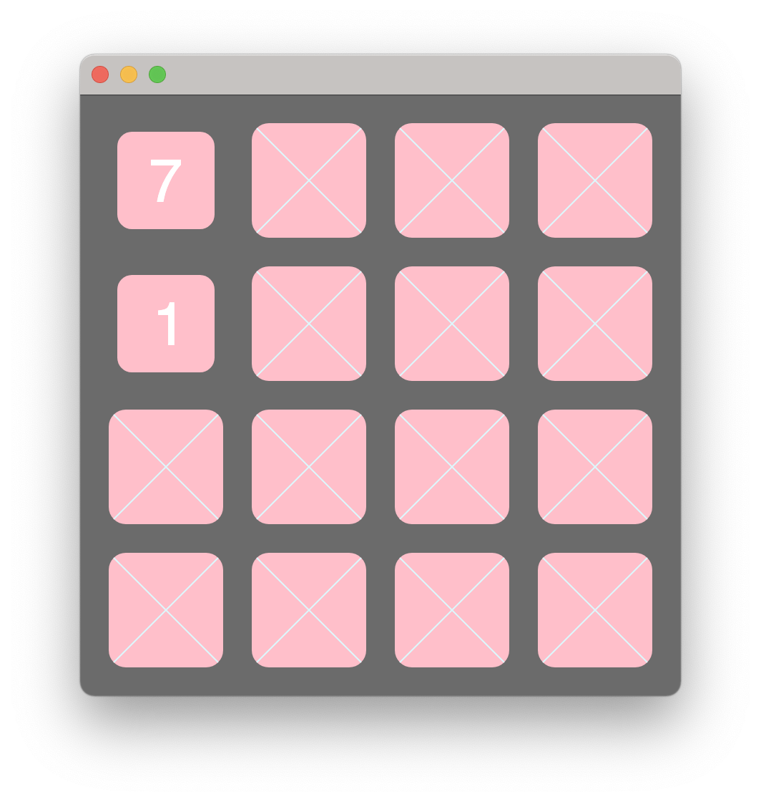

# Tutorials for Bloc

[](./LICENSE)
[](https://github.com/pharo-graphics/Tutorials/actions/workflows/test.yml)

This repository contains examples of [Bloc](https://github.com/pharo-graphics/Bloc) and [Brick](https://github.com/pharo-graphics/Brick).


## Installation

In [Pharo](https://pharo.org/download) 11, evaluate:

```smalltalk
Metacello new
    baseline: 'BlocTutorials';
    repository: 'github://pharo-graphics/Tutorials:dev-1.0/src';
    load
```


## Memory Game Tutorial

This is a Memory Card game.
Please, find the code at the `Bloc-Memory` package.

The present code is the result of following the Bloc tutorial in [this booklet](https://files.pharo.org/books-pdfs/booklet-Bloc/2017-11-09-memorygame.pdf), with some little name adaptations.
The source code for such booklet can be found [here](https://github.com/SquareBracketAssociates/Booklet-BuildingMemoryGameWithBloc).





To start it, evaluate this code:

```smalltalk
"Create the game model and the Bloc element."
aGameElement := MGGameElement new
	memoryGame: MGGame withNumbers;
	yourself.

"The space represents the window"
space := BlSpace new.
space addChild: aGameElement. 

"Calculate the extent of the game board for the first time, to set it to the window."
space pulse.
space extent: aGameElement extent.

"Show the window"
space show. 
```

By default, a Morphic window will popup. It is also possible to open a OS "external" window. To do it, open "System Settings > Appearance > Bloc" and select "OSWindow - SDL2" in "Preferable Host".


## Reordering Examples

This example shows how to use drag-and-drop, and it's written using Bloc and Brick.


To execute it, evaluate the following code:

```smalltalk
pane := DTPaneCreatingReorderingHandler new 
        fittingColumns   
        constraintsDo: [ :c | 
            c horizontal matchParent.
            c vertical matchParent ];
        yourself.
space := BlSpace new extent: 800@600.

space root addChild: pane.
space show.
```

Thanks @StephanEggermont for the contribution.


## License

This code is licensed under the [MIT license](./LICENSE).
